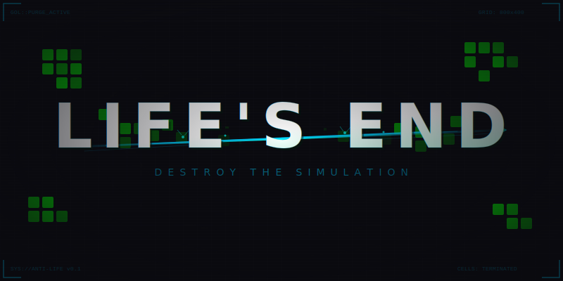

<p align="center">
  
</p>

<p align="center">
  <strong>A nihilistic virus, destined to destroy all possible life.</strong>
</p>

<p align="center">
  
  
  
  
</p>

---

## The Concept

> *In the beginning there was the Monad -- the source, the origin, the blind will to exist.*
> *It spawns, it evolves, it adapts. It does not think. It does not feel. It simply persists.*
>
> *And then there was you. The antithesis. The nihilistic virus.*
> *You do not create. You do not preserve. You annihilate.*
>
> *The Monad never gives up. It mutates, it swarms, it finds a way.*
> *This is not a war you can win. This is an endless evolving battle between Creation and Annihilation.*

**Life's End** fuses three classic game mechanics into something that shouldn't work together -- but does:

- **Asteroids** -- inertia-based thrust, drifting through space, bouncing off walls
- **Snake** -- a growing tail that trails behind you, gaining mass and lethality
- **Conway's Game of Life** -- the Monad, your enemy, obeying the eternal rules of B3/S23

You pilot a virus through an arena teeming with the Monad's creations. They breed, they oscillate, they glide, they mutate when cornered. Clear a level and the Monad returns stronger -- more organisms, more mutations, faster evolution. It never stops. It never surrenders. It simply *is*.

---

## Mechanics

### Movement (Rocket League Vibes)

| Key | Action |
|-----|--------|
| `W` / `Up` | Thrust forward |
| `A` / `D` / `Left` / `Right` | Rotate |
| `S` / `Down` | Hard brake |
| `Shift` | Boost (burns fuel for massive acceleration) |

The physics feel heavy and satisfying. Drift into turns, powerslide around corners, slam the brakes. Your tail adds mass -- the longer it gets, the more sluggish you become. Risk vs reward.

### Combat

| Key | Action |
|-----|--------|
| `Space` / `Left Click` | Shoot projectile |
| `Q` | **NUKE** (requires 10+ tail segments) |

- **Projectiles** bounce once off arena walls and travel up to the arena's diagonal length
- **10% aim assist** nudges bullets toward the nearest cell within a 28-degree cone
- **Ramming** (head-on collision) destroys a cell without hurting you
- **Tail whip** -- your tail segments destroy any cell they touch
- **Nuke** -- sacrifice your entire tail to scramble every enemy group: deletes 3 random cells from each, then mutates 5 new cells onto the survivors

### The Enemies: Living Cells

The cells aren't just static targets. They obey Conway's Game of Life:

- **B3/S23 rules**: cells with 3 neighbors are born, cells with 2-3 neighbors survive
- **Stagnation mutation**: any cell alive for 16 consecutive ticks spawns a random neighbor -- still lifes don't stay still for long
- **Level mutations**: some enemies start pre-mutated with extra random cells attached
- **Swarm limit**: if total cell count reaches **100**, life overwhelms you -- **game over**

### Progression

- **Level N** spawns `3 + N` enemies (level 1 = 4 enemies, level 10 = 13 enemies)
- Every odd level adds more mutated enemies
- Mutation intensity scales with level
- GoL tick rate increases as levels progress (0.45s down to 0.1s)
- Wave reinforcements spawn on every 3rd level when cell count drops low
- Pattern complexity increases: early levels get blinkers and toads, later levels get r-pentominoes, spaceships, and pulsars

---

## My Take on the Game Logic

The design creates **emergent pressure** that I find genuinely interesting:

**The core tension is time.** You're not fighting static enemies -- you're fighting a system that evolves. Leave a glider alone and it drifts harmlessly. Leave an r-pentomino alone and it explodes into 100+ cells and kills you via swarm limit. The stagnation mutation means even "safe" still-life patterns eventually grow. Every second you're not killing is a second life is gaining ground.

**The tail creates a beautiful dilemma.** Growing your tail makes you stronger (more whip coverage, nuke access) but heavier (harder to maneuver). A 20-segment tail can sweep through cell clusters like a scythe, but good luck dodging a glider fleet. The nuke adds a reset valve -- sacrifice your power to scramble the board when things get desperate.

**The nuke is deliberately chaotic.** It doesn't just kill -- it *mutates*. Deleting 3 cells from a group might destabilize an oscillator into something that dies naturally. Or adding 5 cells might accidentally create a glider gun. You're rolling the dice with cellular automata, and that unpredictability is the point.

**The swarm limit is the real antagonist.** It creates a ticking clock that the player can't see directly but can *feel*. When the HUD turns yellow, you know. When it turns red, you panic. It's the GoL equivalent of a horror game's rising water level.

What I find most compelling is that the game essentially asks: *can you outpace evolution?* The cells adapt (mutate when stagnant), reproduce (GoL rules), and swarm (overwhelm threshold). You have brute force (shooting, ramming, whipping) and a nuclear option. It's a race between your destruction and their growth.

---

## Building & Running

### Prerequisites

- [Rust](https://rustup.rs/) (latest stable)
- Windows 10/11

### Build

```bash
git clone https://github.com/noktafa/lifes_end.git
cd lifes_end
cargo run --release
```

> First build takes a while (Bevy compilation). Subsequent builds are fast.

---

## Project Structure

```
src/
  main.rs                     App entry, plugin registration
  states.rs                   GameState: Menu, Playing, Paused, GameOver, LevelComplete
  components/
    player.rs                 Player, Heading, Thrusting, Boosting, BoostFuel, PlayerStats
    tail.rs                   TailSegment, TailChain, PositionHistory
    gol.rs                    LifeCell, CellPosition
    combat.rs                 Projectile, CellDestroyed, NukeActivated
    common.rs                 Velocity
  plugins/
    player.rs                 Ship spawning, input, thrust, drift physics, wall bounce
    tail.rs                   Position history, segment following, growth, tail-whip collision
    gol.rs                    GoL setup, B3/S23 tick, entity sync, wave triggers
    combat.rs                 Shooting (aim assist), projectile movement/bounce, nuke
    collision.rs              Projectile-cell and player-cell (ram) collisions
    camera.rs                 Camera follow, neon arena borders
    level.rs                  Win/lose conditions, swarm limit, level progression
    ui.rs                     Menu, HUD, pause, game over, level complete screens
  resources/
    game_config.rs            All tunable constants (speeds, forces, limits)
    gol_grid.rs               HashSet-based GoL grid, tick, stagnation mutation, nuke logic
    level_config.rs           Procedural level generation, pattern library, mutations
  systems/
    mod.rs                    SystemSet execution ordering
```

---

## Tech Stack

| | |
|---|---|
| **Language** | Rust |
| **Engine** | Bevy 0.15 |
| **Rendering** | Bevy 2D sprites |
| **GoL Engine** | Custom `HashSet<(i32, i32)>` sparse grid |
| **Collision** | Brute-force circle-circle (performant up to ~500 cells) |
| **RNG** | `rand` 0.8 |

---

<p align="center">
  <sub>You are the virus. Life is the disease. There is no cure — only you.</sub>
</p>
